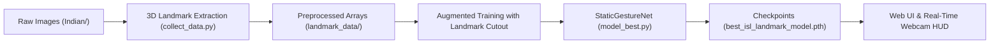

# Internal Project Documentation (`agent/`)

Welcome to the internal engineering and agent documentation directory for the **ISL (Indian Sign Language) Sign Language Classification System**.

This directory maintains comprehensive, continuously updated records of the project's architectural layout, mathematical logic, experimental history, and operational facts.

---

## Documentation Index

| Document | Description | Key Topics |
| :--- | :--- | :--- |
| **[project_structure.md](file:///Volumes/PORTABLESSD/Code/ISL/agent/project_structure.md)** | Architectural Layout & Components | Directory tree, module responsibilities, data flow diagram, dependency graph |
| **[logic_implementation.md](file:///Volumes/PORTABLESSD/Code/ISL/agent/logic_implementation.md)** | Mathematical Formulation & Code Logic | 3D normalization, 316-dim feature vectors, Landmark Cutout algorithm, neural network layers |
| **[trial_history.md](file:///Volumes/PORTABLESSD/Code/ISL/agent/trial_history.md)** | Trials, Benchmarks & Decision History | Evolution timeline, Image CNNs vs 3D Skeletal geometry, occlusion breakthroughs, model comparison |
| **[established_facts.md](file:///Volumes/PORTABLESSD/Code/ISL/agent/established_facts.md)** | System Constraints & Verified Facts | 35-class dataset specs, cache policies, device dispatch (MPS/CUDA/CPU), port mappings |

---

## Architectural Summary

- **Classes**: 35 total (`1-9`, `A-Z`)
- **Top Validation Accuracy**: **99.95%** (`StaticGestureNet`)
- **Key Regularization Innovation**: **Landmark Cutout** (finger cluster masking to simulate hand occlusions)
- **Execution Manager**: `uv` (Python 3.12+)

---

## Document Maintenance Rules

1. When adding or modifying models, update [logic_implementation.md](file:///Volumes/PORTABLESSD/Code/ISL/agent/logic_implementation.md) and [project_structure.md](file:///Volumes/PORTABLESSD/Code/ISL/agent/project_structure.md).
2. When conducting experiments, record observations and trade-offs in [trial_history.md](file:///Volumes/PORTABLESSD/Code/ISL/agent/trial_history.md).
3. Keep [established_facts.md](file:///Volumes/PORTABLESSD/Code/ISL/agent/established_facts.md) updated with environment specs, ports, and dataset metrics.
