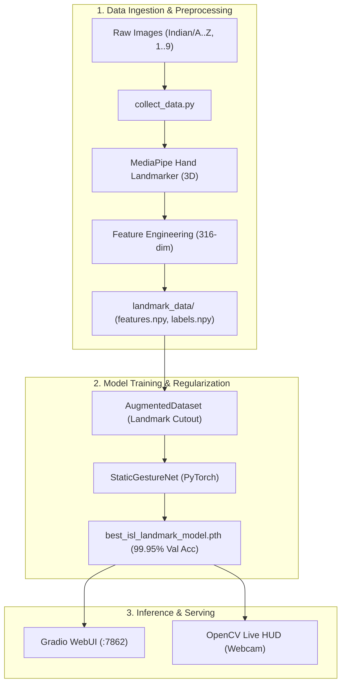

# Project Structure & Architecture

## Overview

The **ISL Sign Language Classification System** is an end-to-end computer vision and deep learning repository designed to classify 35 Indian Sign Language (ISL) static hand gestures (alphanumeric: digits `1-9` and letters `A-Z`). 

The repository provides three distinct model paradigms:
1. **Lightweight Image CNN** (`model1_ultralight.py` — MobileNetV2)
2. **High-Performance Image CNN** (`model2_highperf.py` — ResNet50)
3. **State-of-the-Art 3D Landmark + Bone Geometry Network** (`model_best.py` + `collect_data.py` — Feed-Forward MLP with Landmark Cutout)

---

## Directory Hierarchy

```
ISL/
├── .cache/                              # Local cache directory for model artifacts
│   └── hand_landmarker.task            # Downloaded MediaPipe Hand Landmarker model bundle (7.8MB)
├── .venv/                               # Python virtual environment (managed by uv)
├── agent/                               # Internal Agent Project Documentation
│   ├── README.md                       # Documentation index and architecture summary
│   ├── project_structure.md            # Structural layout and component map (this file)
│   ├── logic_implementation.md         # Detailed logic, mathematical formulas, and algorithms
│   ├── trial_history.md                # Experiments, trial decisions, benchmarks, and pivots
│   └── established_facts.md            # Verified constraints, hardware configs, and specs
├── Indian/                              # Raw ISL Image Dataset (35 classes)
│   ├── 1/ ... 9/                       # Numerical gesture image folders
│   └── A/ ... Z/                       # Alphabetical gesture image folders
├── landmark_data/                       # Preprocessed numpy feature caches
│   ├── class_names.npy                 # Class names array (35 strings)
│   ├── features.npy                    # Pre-extracted 316-dim feature vectors (42,364 × 316 float32)
│   └── labels.npy                      # Target class indices (42,364 int64)
├── best_isl_landmark_model.pth          # Checkpoint for trained StaticGestureNet (PyTorch state dict)
├── collect_data.py                      # Dataset preprocessor & 3D feature extractor
├── model_best.py                        # SOTA 3D Landmark + Bone Geometry model, trainer, UI, & live HUD
├── model1_ultralight.py                 # MobileNetV2 transfer learning model & Gradio UI
├── model2_highperf.py                   # ResNet50 transfer learning model & Gradio UI
├── pyproject.toml                       # Project metadata and dependencies
├── uv.lock                              # Locked dependency graph
└── README.md                            # Primary project documentation & quick start guide
```

---

## Core Components & Modules

### 1. Data Ingestion & 3D Landmark Extraction (`collect_data.py`)
- **Purpose**: Parses the raw image directory (`./Indian/`), feeds images through MediaPipe Hand Landmarker (dual-hand support), calculates 3D geometric features, and caches arrays into `.npy` format.
- **Key Outputs**:
  - `landmark_data/features.npy`: Float32 array of shape `(N, 316)`.
  - `landmark_data/labels.npy`: Int64 array of shape `(N,)`.
  - `landmark_data/class_names.npy`: String array of shape `(35,)`.

### 2. SOTA Landmark & Bone Classifier (`model_best.py`)
- **Purpose**: Defines `StaticGestureNet`, `AugmentedDataset` with Landmark Cutout, training loop with Cosine Annealing and early stopping, Gradio UI (port 7862), and real-time OpenCV webcam HUD.
- **Key Classes / Functions**:
  - `StaticGestureNet`: 4-layer fully connected network (~237K parameters) with Batch Normalization and Dropout.
  - `AugmentedDataset`: Custom PyTorch `Dataset` injecting finger-level structural masking and Gaussian noise.
  - `launch_ui()`: Gradio interface for image upload and top-5 probability breakdown.
  - `launch_live()`: OpenCV live webcam loop with dual-hand skeletal rendering and classification HUD.

### 3. Baseline Image CNNs (`model1_ultralight.py`, `model2_highperf.py`)
- **`model1_ultralight.py`**:
  - Backbone: MobileNetV2 pretrained on ImageNet.
  - Classification Head: 256 hidden units, dropout (0.3/0.2), 35 classes.
  - Web UI: Gradio interface on port 7860.
- **`model2_highperf.py`**:
  - Backbone: ResNet50 (layers 1-2 frozen, layers 3-4 fine-tuned).
  - Classification Head: 512 -> 256 units with BatchNorm1d.
  - Features: Weighted random sampler for class balancing.
  - Web UI: Gradio interface on port 7861.

---

## Data Flow Pipeline



---

## Dependency & Environment Specifications

- **Package Manager**: `uv` (Fast Python package and environment manager)
- **Python Version**: `>=3.12`
- **Key Libraries**:
  - `torch`, `torchvision`: Deep learning framework and transfer learning backbones.
  - `mediapipe`: Hand landmark detection (Tasks API and legacy solutions fallback).
  - `opencv-python-headless` & `opencv-python`: Real-time video processing, drawing, and UI.
  - `gradio`: Web-based interactive interfaces for rapid testing.
  - `scikit-learn`, `seaborn`, `pillow`: Metrics, visualization, and image manipulation.
