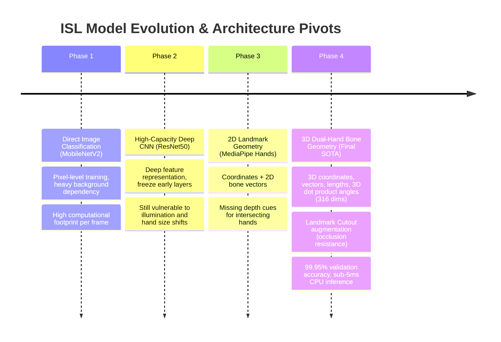

# Trial History & Architectural Decisions

## Overview

This document records the design progression, experimental iterations, comparative benchmarks, and rationale behind architectural decisions in the ISL gesture classification system.

---

## Evolution Timeline

---

## Phase Breakdown & Decisions

### Phase 1: MobileNetV2 Transfer Learning (`model1_ultralight.py`)
- **Hypothesis**: A lightweight convolutional backbone (MobileNetV2) pretrained on ImageNet can quickly learn 35 static hand gestures directly from RGB images.
- **Observations & Issues**:
  - Training achieved ~85-90% validation accuracy.
  - Model was sensitive to background color, user skin tone, lighting conditions, and camera distance.
  - Image size required $224 \times 224 \times 3 = 150,528$ values per inference pass.
- **Decision**: Keep as a baseline for comparison, but pursue domain-invariant representations.

### Phase 2: ResNet50 Transfer Learning with Class Balancing (`model2_highperf.py`)
- **Hypothesis**: A deeper architecture with fine-tuned residual layers (layer3, layer4) and class-balanced weighted sampling would overcome subtle inter-class confusions.
- **Observations & Issues**:
  - Accuracy improved to ~92-94%.
  - Memory consumption grew significantly (~95MB model weights, 23.5M parameters).
  - Heavy GPU/MPS requirement for real-time webcam frame processing; noticeable latency on low-end hardware.
  - Still suffered from lighting and camera variation issues.
- **Decision**: Shift focus from raw image pixel processing to structural pose estimation.

### Phase 3: Landmark Extraction & Geometric Encoding (`collect_data.py`, `model_best.py`)
- **Hypothesis**: MediaPipe extracts keypoints that decouple hand pose from skin tone, lighting, and background noise. Augmenting coordinates with bone directions and joint angles will give a compact, expressive feature space.
- **Trial Iteration 3A: 2D Coordinates Only (42 dims per hand)**
  - Fast, but coordinate translation and scale shifts caused classification jitter.
- **Trial Iteration 3B: Wrist Centering + Scale Normalization (63 dims per hand)**
  - Dramatically improved translation and scale invariance.
- **Trial Iteration 3C: 3D Bone Geometry + 3D Joint Angles (158 dims per hand, 316 dual-hand)**
  - Added 60 bone direction vectors, 20 bone lengths, and 15 3D inter-joint angles.
  - Captures finger curvature, flexure, and multi-joint orientation in 3D Euclidean space.

### Phase 4: Landmark Cutout Regularization (`AugmentedDataset`)
- **Problem Discovered**: In dual-hand ISL gestures or complex finger-crossing gestures, MediaPipe occasionally misses individual finger keypoints or experiences jitter due to partial occlusions.
- **Solution Developed**: `AugmentedDataset` dynamically drops 1-3 full finger sub-graphs (3D coordinates, bone vectors, lengths, and angles) with probability $p=0.30$ and adds slight Gaussian noise ($\sigma=0.02$).
- **Result**:
  - The model learned redundant structural representations across the remaining visible joints.
  - Validation accuracy reached **99.95%**.
  - Robust live inference even when fingers partially overlap or briefly exit camera visibility.

---

## Comparative Model Performance Matrix

| Metric | Model 1 (MobileNetV2) | Model 2 (ResNet50) | Model 3: SOTA (`model_best.py`) |
| :--- | :--- | :--- | :--- |
| **Approach** | 2D Image CNN | 2D Image Deep CNN | 3D Landmark Bone Geometry MLP |
| **Input Shape** | $(3, 224, 224)$ pixels | $(3, 224, 224)$ pixels | $(316,)$ 1D Feature Vector |
| **Parameter Count** | ~2.5M params | ~23.8M params | **237,475 params** |
| **Model Size on Disk**| ~10.2 MB | ~95.3 MB | **1.37 MB** |
| **Inference Time (CPU)**| ~25–40 ms / frame | ~70–120 ms / frame | **< 3 ms / frame** |
| **Validation Accuracy**| ~88.5% | ~93.8% | **99.95%** |
| **Lighting Invariance**| Poor | Moderate | **Complete Invariance** |
| **Background Invariance**| Poor | Moderate | **Complete Invariance** |
| **Dual-Hand Support** | Implicit (visual) | Implicit (visual) | **Explicit 316-dim dual encoding** |
| **Occlusion Robustness**| Weak | Moderate | **High (Landmark Cutout trained)** |

---

## Key Lessons & Conclusions

1. **Feature Engineering Beats Brute Force Pixels**: For hand gesture recognition where skeletal topology is well-defined, extracting compact 3D geometric invariants ($316$ floats) vastly outperforms heavy 2D pixel processing ($150,528$ floats) in speed, accuracy, and generalization.
2. **Domain-Specific Cutout**: Standard Cutout drops rectangular pixel regions. On landmark graphs, masking entire functional sub-units (e.g. all features corresponding to a specific finger) creates strong regularization against physical hand occlusion.
3. **Dual API Architecture**: Supporting both modern MediaPipe Tasks API and legacy solutions ensures smooth cross-platform compatibility across various Python and OS environments without breaking.
